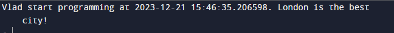

# Звіт до роботи №1
## Тема: _Оформлення та здача робіт_
### Мета роботи: _навчитись роботі з форматуванням Markdown та створювати звіти з використанням файлів README_
---
### Виконання роботи
- Результати виконання завдання:
    1. Виконали першу програму, результат виконання: 
    1. Модифікували програму та використали [Python Notebook для її виконання](nb.ipynb);
    1. Зробили запит до ChatGPT щоб написав та поясним першу програму. Модифікували його відповідь на її основі зробили [новий Python Notebook](nb.ipynb);
    1. Після виконання всіх комірок, оформили звіт та закомітили всі зміни до репозиторію;
    1. Навчились створювати першу програму, працювати у Python Notebook, ставили запитання до ChatGPT та формутували його відповідь у відповідні клітинки Python Notebook;

### Висновок: 
- :question: Що зроблено в роботі: навчились працювати з форматуванням Markdown, створили першу програму на Python, навчились працювати у Notebook, та задали запит до ChatGPT :white_check_mark:
- :question: Чи досягнуто мети роботи: все зроблено :white_check_mark:
- :question: Які нові знання отримано: вперше попрацювали в Python Notebooks :notebook_with_decorative_cover:
- :question: Чи вдалось відповісти на всі питання задані в ході роботи: так :100:
- :question: Чи вдалося виконати всі завдання: так :100:
- :question: Чи виникли складності у виконанні завдання: ні
- :question: Чи подобається такий формат здачі роботи (Feedback): :ok_hand:
- :question: Побажання для покращення (Suggestions): :ok_hand:
---
