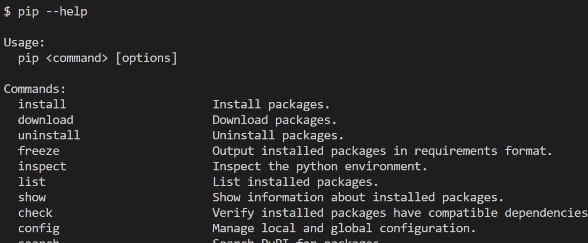

# Звіт до роботи № 4
## Тема: _Робота з віртуальнимим середовищами_
### Мета роботи: _Навчитись створювати та працювати у віртуальних середовищах Python_
---
### Виконання роботи
- Результати виконання завдання:
    1. Створили віртуальне середовище за допомогою venv та pipenv. Створені [Pipfile](./Pipfile) та [Pipfile.lock](./Pipfile.lock);
    1. Навчились створювати та працювати у віртуальних середовищах;
    1. Попросили ChatGPT створити сайт з бібліотеки Flask [web](web.py) 

- результати виконання індивідуального завдання:
    - робимо завдання із зірочкою, наприклад що можна робити за допомогою команди pip:
    
    - Також зробили решту завдань та спробували заходити у віртуальні середовища;

---
### Висновок: 
> у висновку потрібно відповісти на запитання:

- :question: Що зроблено в роботі;
- :question: Чи досягнуто мети роботи;
- :question: Які нові знання отримано;
- :question: Чи вдалось відповісти на всі питання задані в ході роботи;
- :question: Чи вдалося виконати всі завдання;
- :question: Чи виникли складності у виконанні завдання;
- :question: Чи подобається такий формат здачі роботи (Feedback);
- :question: Побажання для покращення (Suggestions);

---
